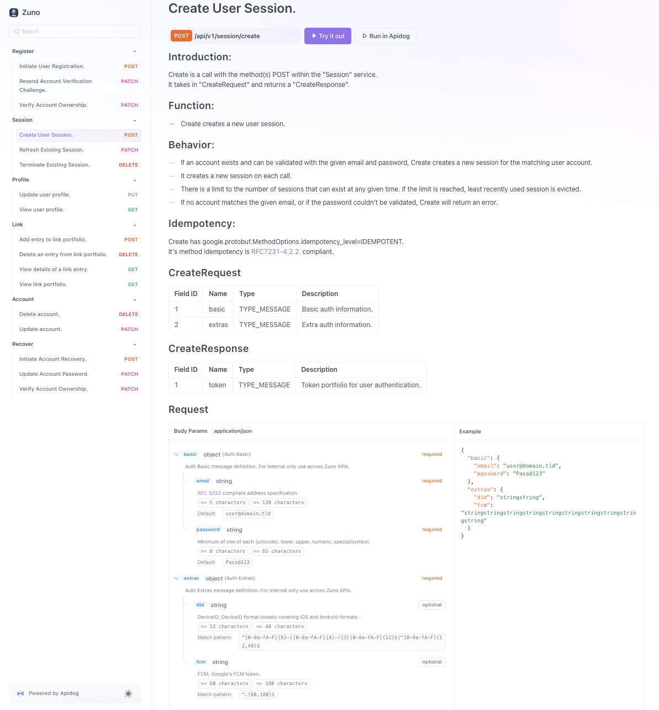
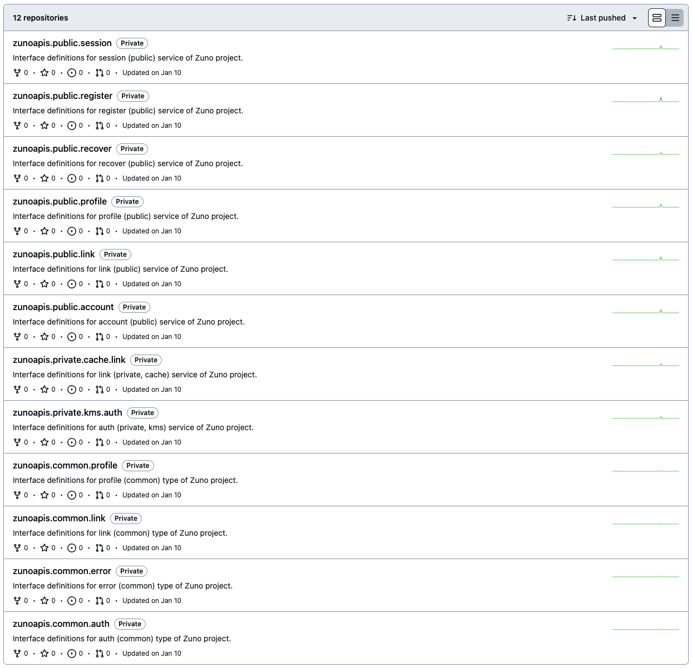
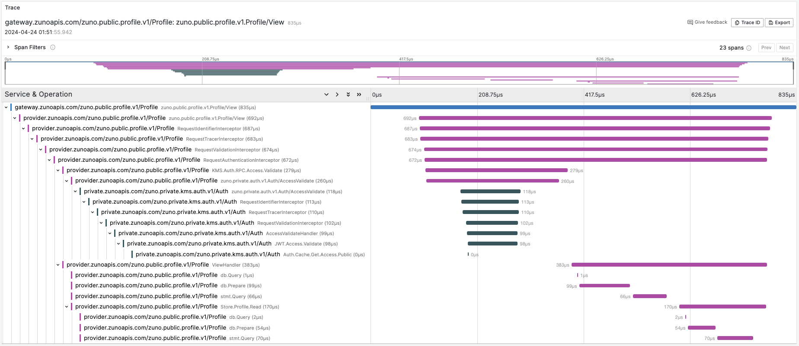
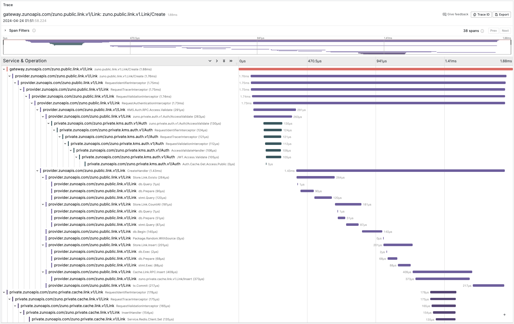
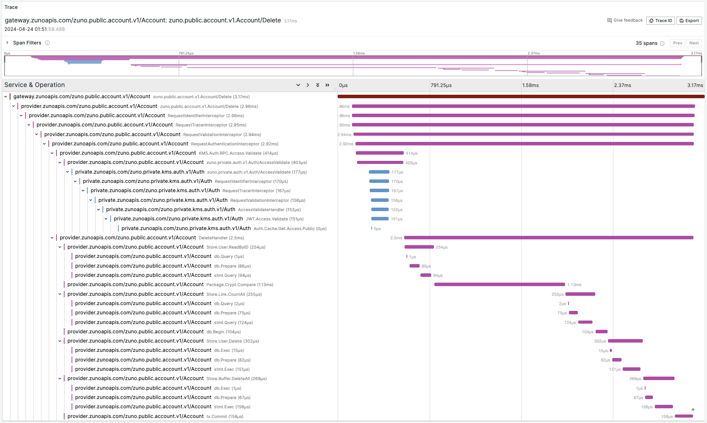
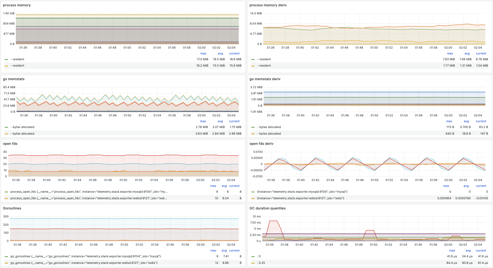
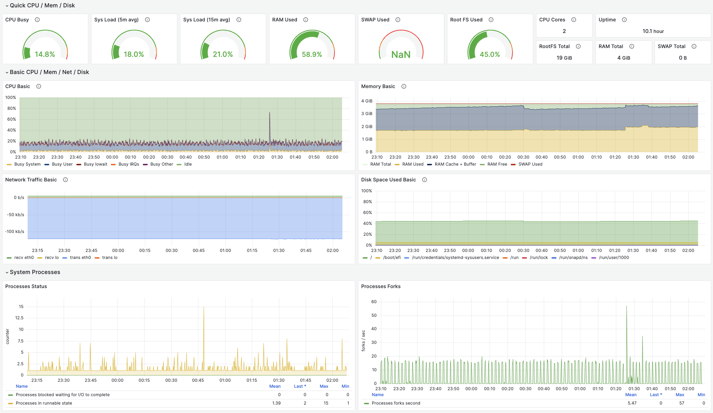
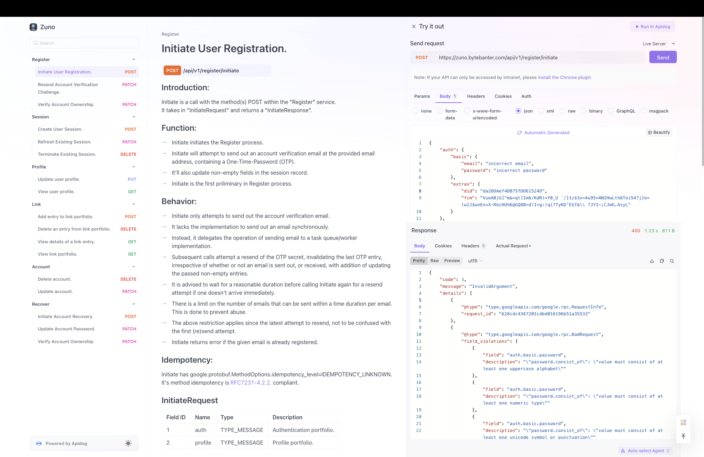
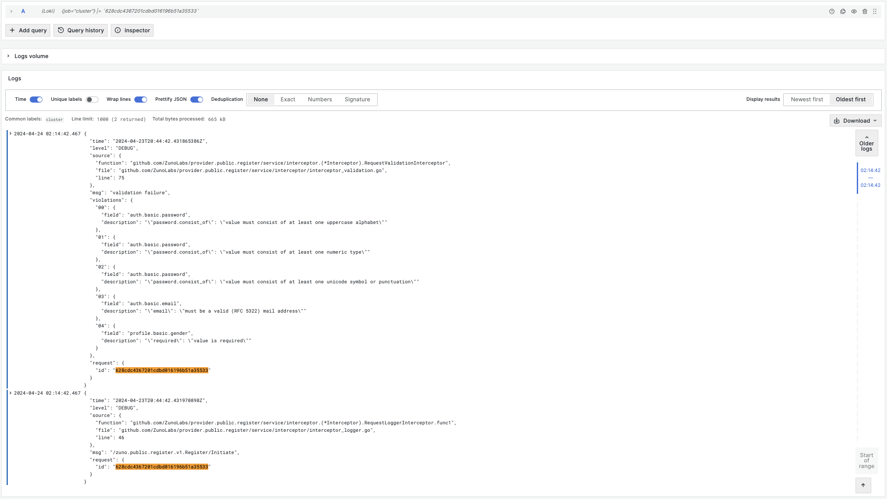
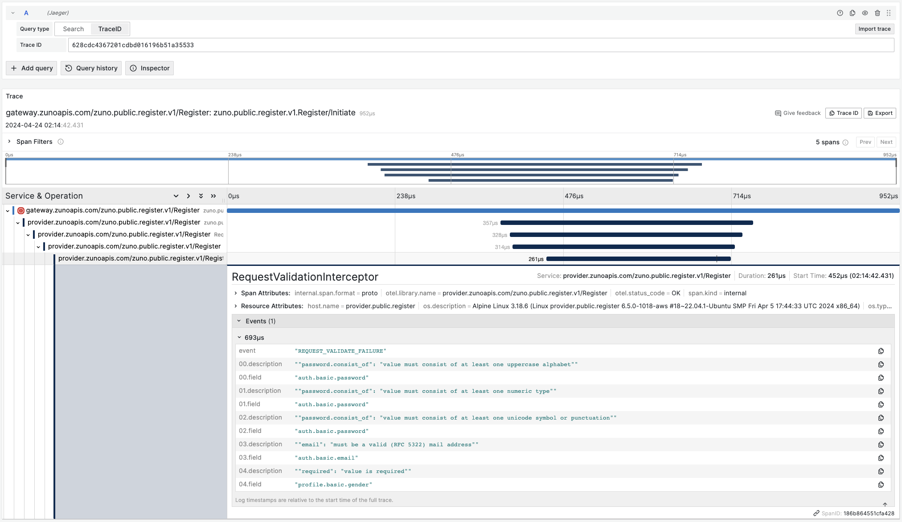

# Zuno Project: The Perfect Backend
_"Perfect Backend" is a very strong claim. However, I'm confident once you get to know enough about the project, through this write-up, a 1-on-1 presentation, or through some other means, you'd be in agreement with the claim._

_The best outcome I consider would be if Zuno inspires you to make something yourself (if you haven't already) striving for (reasonable) perfection - as it did many others. Cheers!_

## Background, Motivation, and Engineering Context:
I realized fairly early in my role as an engineer that the implementation details were a means to an end for business goals. I aligned myself to that realization, which enabled me to understand both engineering and business aspects of the problems, and build solutions more aligned to the end goal. However, I felt within me a long-suppressed drive to create something out of the sheer joy of creating - something not tied to a scope, to distill the absolute best of my experience, learning, and engineering capability.

Zuno is the outcome of that drive.

Zuno is a link shortener - and I've purposefully chosen it to be one, rather than a novel or a fancy idea. I know exactly what it does, and so does everyone. The intent with this project is to focus on the art of engineering, not the product.

## Project Highlights:
Zuno has many highlights, among which I'll focus on the top 3 'anchors', and will try to very briefly touch upon a few others.

1. API Contracts act as a source of truth.
2. Engineered based on security principles of zero trust.
3. Observability is built into every cross-section, layer, and service.

### API Contracts: Single Source of Truth
Traditionally, APIs are designed and developed based on a specification, such as a Problem Requirement Document (PRD). In such cases, either the PRD, or the API Specification Document derived from it become the source of all further design and development.

The style of writing Zuno implements uses a set of tools in a fashion such that the API specification is not written as an MS Word, a Confluent document, or something similar. It is rather a programmable contract, that can be used to generate boilerplate code that include the following components that define an API, in multiple supported languages:
- **Service and Message schema**: These define the endpoint, message exchange behavior, and request and response schema for each API.
- **Error schema, and list of all success and failure responses**: Defines error schema(s) pertinent to individual types of errors, and a list of possible error responses the API can return.
- **Field specification and validations**: Information about every individual field (for example, if a field is required, or is optional), and the preliminary validations that must be performed on the field.
- **Cross-protocol translation; Standardized specification (OpenAPI)**: Defines the specification needed to translate REST calls to RPC, and vice-versa. Also defines other information for generating OpenAPI specification. Of course, the OpenAPI specification may be used to document, track, and serve other purposes encompassing the above API components.
- **Integration test components** (this is still a work-in-progress): The message specification and the field specification and validation can be used to generate valid data needed for various use cases, a pertinent one being integration testing that ensures validity of the APIs.

Additionally, contracts can import other contracts as subcontracts. Zuno does it using Git. This enables easier integration of, and tracking common subcomponents. For example: A user sign-up may require the user to enter profile details, which should match the profile schema; in such a case, a contract can be created consisting of the 'profile' object, which could be shared between the contracts of services handling SignUp, and Profile APIs.

Also, the API behavior definition, and the usage documentation can be incorporated into the contract, right next to the programmable components, such as service and message schemas, and even the individual fields. This reduces "drift" between the programmable component and its usage documentation compared to hosting it somewhere else, such as Confluent Cloud.

#### Section Samples: Screenshots
Sample API Documentation with Behavior Definition and Request Specification:


Service API Contracts as GitHub repositories:


### Implementing Security Principles of Zero Trust
_Disclaimer: I'm not a security expert. I've done the best I could with the knowledge and experience I had. However, I recognize that my knowledge on the subject of security may have gaps. Open to suggestions/criticism around the subject._

Zuno project incorporates an independent KMS subsystem I built as a necessity. It assumes the threat actor has some level of internal access - for example, a developer in the same team, and tries to defend against such an actor. For this, it uses sets of self-rotated, short-lived, asymmetric cryptography keys that may be used for encryption/decryption and signing/validation.

#### Section Samples: Keysets
**Private keyset pre-rotation**:
```json
{
    "keys": [
        {
            "alg": "ES256",
            "crv": "P-256",
            "d": "SaULxkU1AdKKS_xlV1YHIl-WeQxEi3l9crTLWGKvPzU",
            "kid": "MwzAeUTP",
            "kty": "EC",
            "use": "sig",
            "x": "WQ3n-qNZNkgzDiIbNCoS4PWZIqovHvUV434vyAuL_l4",
            "y": "FxiD_Um4_wt7dnXa2Ji7lynfyUpyTlDZmKMAy__qf4o"
        },
        {
            "alg": "ES256",
            "crv": "P-256",
            "d": "rttoE9mdY92zWAJ2TY9eCnKHHGKIHTgWDmjUytRDeY8",
            "kid": "QBXlYfPx",
            "kty": "EC",
            "use": "sig",
            "x": "-YG2UzAguC2gDSWDTopDoqxyMxNQa_PoHrCejwqXCqg",
            "y": "OM_5vtUYgfeoJ7PH6k3a8pV2AotLTrGeTmr4HzdgSNA"
        },
        {
            "alg": "ES256",
            "crv": "P-256",
            "d": "XKJZNh6a8_lotQJDFB-_d6CBJUL9rUcOVMwP2ARzkTo",
            "kid": "ZlBpLAlz",
            "kty": "EC",
            "use": "sig",
            "x": "fOLCydjR29Oww6CkuZjYCvtcpzPIuhTjZzQfZmQxV5s",
            "y": "2ZljZLV0KijxnM0hCKM7sX1L2LgV6Cai2YsbmPrlQdw"
        }
    ]
}
```
**Private keyset post-rotation**:
```json
{
    "keys": [
        {
            "alg": "ES256",
            "crv": "P-256",
            "d": "QzWUMYy7KtKDHJ1qsVp99tchJRrN7S0UIAfB8dj2f-A",
            "kid": "MUlSLFcU",
            "kty": "EC",
            "use": "sig",
            "x": "nybi8kXiri_JJLeFQutZTw2AqZO5mBOIz4y6SI6ifwk",
            "y": "VTihVwwlStHuPPQ9dEXOBCJH-6feY2pu7-TYssDofNw"
        },
        {
            "alg": "ES256",
            "crv": "P-256",
            "d": "SaULxkU1AdKKS_xlV1YHIl-WeQxEi3l9crTLWGKvPzU",
            "kid": "MwzAeUTP",
            "kty": "EC",
            "use": "sig",
            "x": "WQ3n-qNZNkgzDiIbNCoS4PWZIqovHvUV434vyAuL_l4",
            "y": "FxiD_Um4_wt7dnXa2Ji7lynfyUpyTlDZmKMAy__qf4o"
        },
        {
            "alg": "ES256",
            "crv": "P-256",
            "d": "rttoE9mdY92zWAJ2TY9eCnKHHGKIHTgWDmjUytRDeY8",
            "kid": "QBXlYfPx",
            "kty": "EC",
            "use": "sig",
            "x": "-YG2UzAguC2gDSWDTopDoqxyMxNQa_PoHrCejwqXCqg",
            "y": "OM_5vtUYgfeoJ7PH6k3a8pV2AotLTrGeTmr4HzdgSNA"
        }
    ]
}
```
Notice the key-rotation. Example sourced between 5-minutes interval from one of the demo environments.


All communication between member and direct-dependency services happens over mTLS-enforced connection.

Additionally, I've defined verbose network policies across all services, and role-based access control for internal and external access across the underlying cluster.

### Application Observability: Logging, Tracing, and Metrics

Zuno uses OpenTelemetry for vendor-agnostic tracing, slog library for structured logging, and OpenTelemetry along with other exporters for capture metrics. It uses OpenTelemetry Collector as an agent for tracing and metrics collection, along with a MultiWriter and a Promtail sidecar to export service logs to Loki.

Detailed telemetry collection has enabled me to do the following:
- Get a complete, granular view of the system and component behaviors.
- View request input, output, lifecycle spanning multiple microservices, latency measurements, and track possible errors.
- Understand service and infrastructure behavior, and anticipate future requirements based on available data.
- Reconcile with consumers and client applications using RequestIDs.
- Investigate incidents based on point-in-time (timeseries) data.
- Observe application behavior in practice, which was otherwise something I'd only read about in blogs, and academia.
- Make optimizations, and gather results based on collected data.

Despite the level of detailed telemetry, its performance overhead remained fairly minimal. Here are some data points relevant to the observation:
- The P99 latency for the slowest API within the cluster was observed at 20ms, with 40+ services running on a single t2.medium instance (2 vCPUs, 4 GiB RAM), on low network load of 10^1 concurrent requests, reaching 120 ms on 10^2 concurrent requests. P99 latency for the fastest API clocked in at 4 ms on the same t2.medium instance with 10^1 concurrent requests, and 80 ms on 10^2 concurrent requests.
- P99 latency dropped to 8 ms for the slowest API when running on a single node Kubernetes cluster running locally (Minikube; M2 Air, 16 GiB RAM), against 10^2 concurrent requests. P99 latency for the fastest API was less than 1 ms against 10^2 concurrent requests.

#### Section Samples: Screenshots
Request Trace: Profile Service, View API:

Request Trace: Link Service, Create API:

Request Trace: Account Service, Delete API:

Logs Viewer: Register Service:

Metrics Dashboard: Golang Processes:

Metrics Dashboard: Node Exporter:


### Other Highlights:
- Zuno spans 40+ gRPC and REST speaking production-ready microservices.
- Zuno implements [Google's AIPs](https://google.aip.dev/general). Its error responses are identical to GCP’s error response style, convention, thoroughness, reconciliation, and possible resolution.
- As a product, Zuno is essentially a cluster of services that define a set of APIs. Therefore, its frontend is essentially a live, interactive documentation. The documentation defines:
  - Idempotent behavior.
  - Message examples.
  - Message generation specification.
  - Live endpoint(s) for testing.

#### Section Samples: Text and Screenshots
Sample error reporting, along with reconciliation:
- API Endpoint: /api/v1/register/initiate
- Complete Request Message:
```json
{
    "auth": {
        "basic": {
            "email": "incorrect email",
            "password": "incorrect password"
        },
        "extras": {
            "did": "da26DAef4DB75fDD61524D",
            "fcm": "VueABjG[^m&<qt[Im6/KdR)=Y0_U `/}1z$3x=4u95=ANIHwLt%6Toi54?j}e>(w2J$wnE*vX-RkcHU%6@GQ8B>d!I=g:)qi?7yKD'E$f&\\ ?JYI~;CJmG.AsyL"
        }
    },
    "profile": {
        "basic": {
            "gender": "",
            "name": "Hardeep Narang"
        },
        "extras": {}
    }
}
```
- Complete Response Message:
```json
{
    "code": 3,
    "message": "InvalidArgument",
    "details": [
        {
            "@type": "type.googleapis.com/google.rpc.RequestInfo",
            "request_id": "628cdc4367201cdbd016196b51a35533"
        },
        {
            "@type": "type.googleapis.com/google.rpc.BadRequest",
            "field_violations": [
                {
                    "field": "auth.basic.password",
                    "description": "\"password.consist_of\": \"value must consist of at least one uppercase alphabet\""
                },
                {
                    "field": "auth.basic.password",
                    "description": "\"password.consist_of\": \"value must consist of at least one numeric type\""
                },
                {
                    "field": "auth.basic.password",
                    "description": "\"password.consist_of\": \"value must consist of at least one unicode symbol or punctuation\""
                },
                {
                    "field": "auth.basic.email",
                    "description": "\"email\": \"must be a valid (RFC 5322) mail address\""
                },
                {
                    "field": "profile.basic.gender",
                    "description": "\"required\": \"value is required\""
                }
            ]
        }
    ]
}
```
Interactive Documentation: Sample Request/Response with Error Details:

Administrative Dashboard: Error Reconciliation with Request Logging:

Administrative Dashboard: Error Reconciliation with Request Tracing:


## Final Thoughts:
I've presented the Zuno project to my close network of fellow engineers, all of whom have expressed strong interest, some even motivated to create something of their own of similar scale. Many have also suggested that I should build a product around it, or some of its components, which is flattering to say the least.

Zuno has been a culmination of a strong drive to create something exceptional, and to solve problems my team and I faced. I aimed for perfection, discovered my own shortcomings in the process, filled the knowledge gaps with practice, and my work now is a source of pride for me. However, I know not to rest with Zuno. It's a launchpad. There are many more challenges to take on and problems to solve. Zuno raises the bar higher, for me, as I hope it does so for you.
